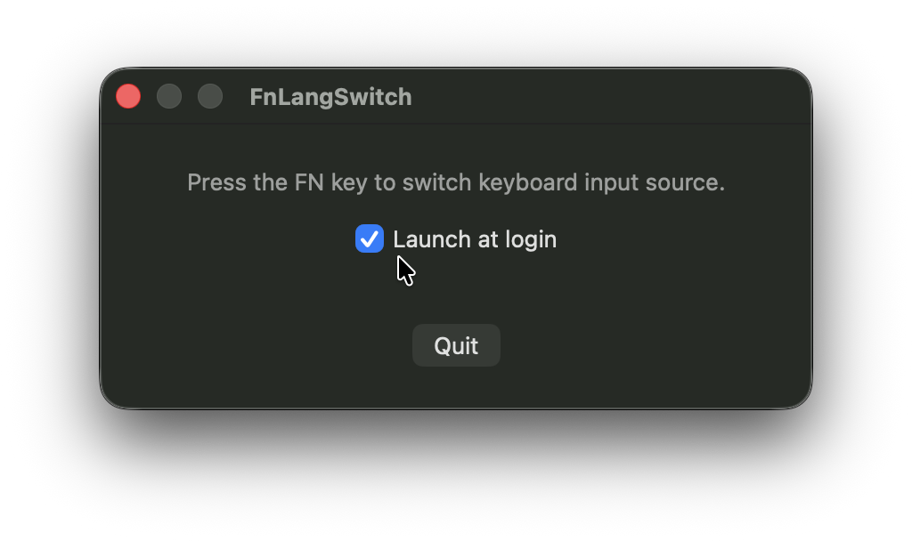

## Problem

macOS uses FN/Globe key to show an input source picker popup, which is slow and distracting. FnLangSwitch replaces that with a direct, instant toggle between your keyboard layouts.

## Solution

A minimal macOS app that switches your keyboard input source (language) when you press the **FN** key. No popups, no delays — instant, invisible switching. The app runs in the background with no dock icon and no menu bar icon.

 

## Download

Download the latest version from [GitHub Releases](https://github.com/tonku321/fn-lang-switcher/releases/latest).

## Usage

1. Go to **System Settings > Keyboard** and set **"Press globe key to"** to **"Do Nothing"**. This prevents macOS from showing its own input source picker when you press FN.
2. Launch the app
3. Press **FN** to toggle between your input sources. That's it.

## How it works

- Monitors the FN key via `NSEvent.addGlobalMonitorForEvents(matching: .flagsChanged)`
- Switches input sources using the Carbon `TISSelectInputSource` API
